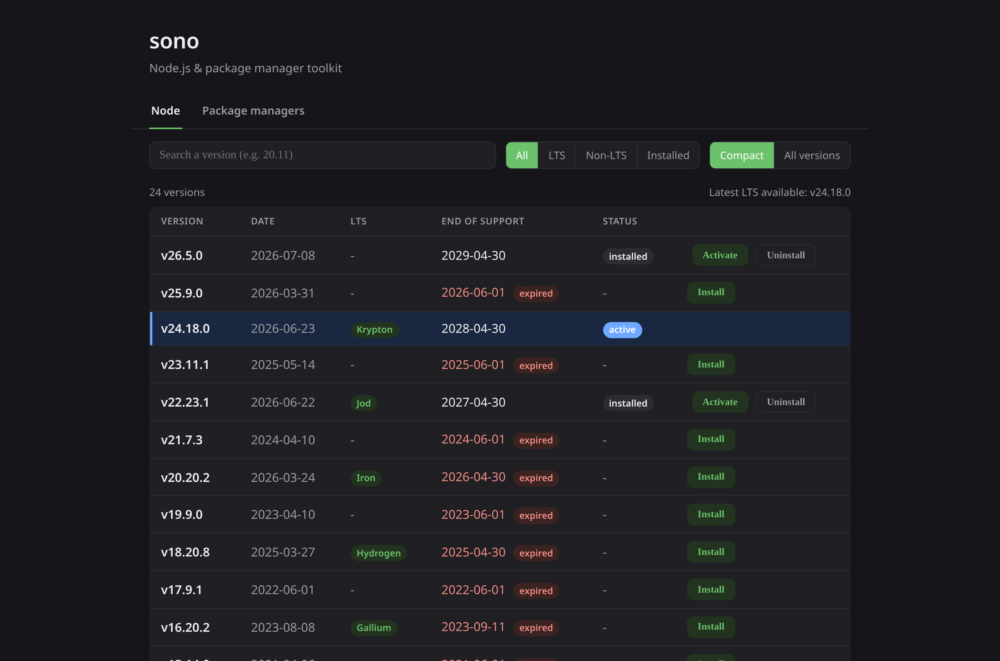
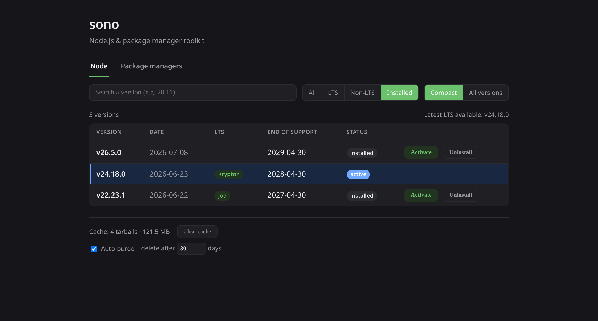
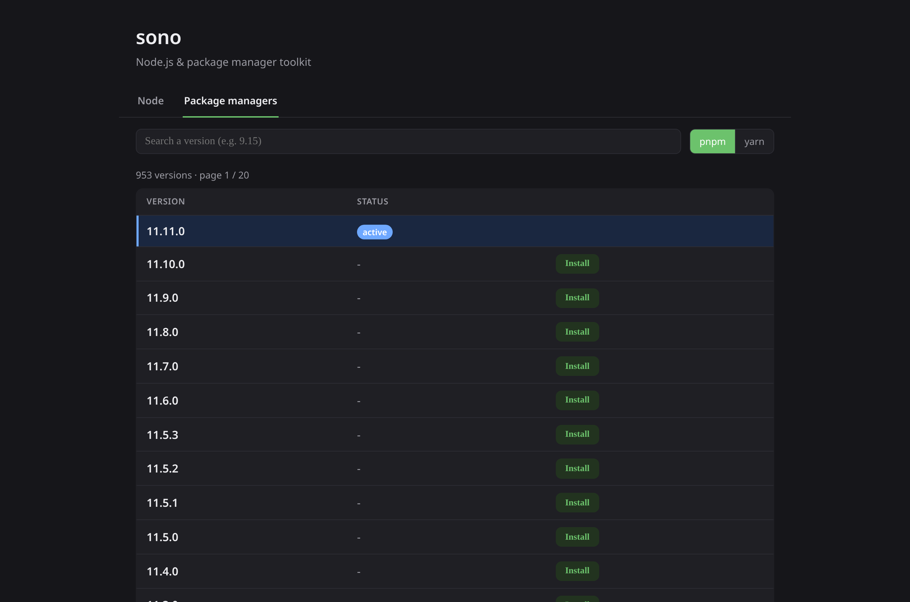
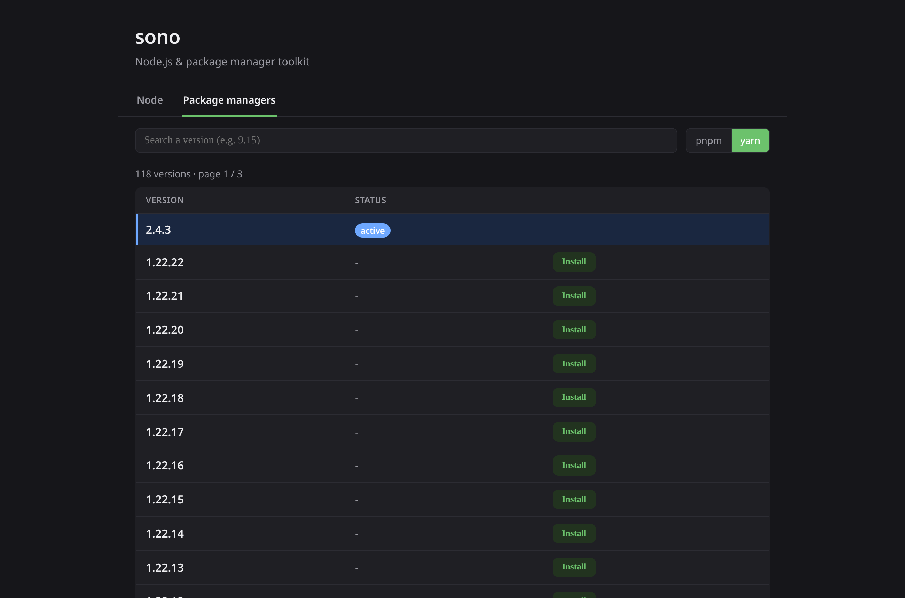

<p align="center">
  
</p>

<p align="center">Node.js &amp; package manager toolkit</p>

sono is a single, self-contained Go binary that manages Node.js versions and package managers from a local web dashboard.
It plays the same role as nvm, fnm or volta, but every action happens in your browser instead of the command line.
No Node.js needs to be installed on the machine beforehand.

## Features

- Browse, install, activate and uninstall Node.js versions straight from nodejs.org.
- Filter by LTS / non-LTS / installed, search by version prefix, paginated list.
- End-of-support dates per release, and an "update available" badge when a newer patch exists in the same minor line.
- SHA256-verified downloads (a tampered checksum fails cleanly, with nothing extracted).
- One-click activation through an atomic `current` symlink (instant, reversible, no root).
- Package managers: install, activate and uninstall pnpm and yarn (SHA512-verified npm packages), run through shims that use the active Node.
- Tarball cache view with a manual purge and an age-based auto-purge, both configurable from the UI.
- Clean UI touches: confirmation modal for destructive actions, success/error toasts, and a PATH helper with a copy button that only shows while the PATH is not set up.

## Screenshots

Node.js versions - browse, filter (LTS / non-LTS / installed), install, activate and uninstall:



Installed versions with end-of-support dates, plus the tarball cache (manual purge and age-based auto-purge):



Package managers - manage pnpm and yarn versions just like Node:





## Requirements

- Go 1.26 or newer to build.
- The only third-party dependency is `github.com/ulikunitz/xz` (pure Go), used to decompress Node's `.tar.xz` archives.

## Build and run

```sh
go build -o sono .
./sono                      # serves http://127.0.0.1:8420
./sono -addr 127.0.0.1:9000 # custom address
```

Then open http://127.0.0.1:8420 in your browser.

## PATH setup

Add this line to your `~/.bashrc` (or shell equivalent), then open a new terminal:

```sh
export PATH="$HOME/.sono/current/bin:$HOME/.sono/shims:$PATH"
```

- `~/.sono/current/bin` exposes the active Node.js (`node`, `npm`, `npx`).
- `~/.sono/shims` exposes the active package managers (`pnpm`, `yarn`, ...).

The dashboard shows this exact line with a copy button, and only reminds you while it is missing.

## Data layout

Everything lives under `~/.sono/`:

```
~/.sono/
  versions/        installed Node.js versions (extracted tarballs)
  current -> ...    symlink to the active Node.js version
  shims/           active package-manager commands (on PATH)
  pm/              installed pnpm / yarn versions + registry caches
  cache/           downloaded Node.js tarballs (reusable, purgeable)
  index.json       cached nodejs.org version index
  schedule.json    cached Node.js release schedule (end-of-support dates)
  config.json      persisted settings (cache auto-purge)
```

## How it works

- Node.js versions are downloaded as the official `.tar.xz`, verified against `SHASUMS256.txt`, and extracted into `~/.sono/versions/`.
The active version is just the `current` symlink, so switching is instant and reversible.
- Package managers are downloaded as their npm package `.tgz`, verified against the registry SHA512 integrity, and extracted into `~/.sono/pm/`.
Activating one writes shims into `~/.sono/shims/` that run the package manager with the active Node.

## Tech

- Backend: Go standard library, plus `github.com/ulikunitz/xz`.
- Frontend: server-rendered `html/template` with htmx (vendored, no build step, no CDN, works offline).

## Design docs

Deeper design notes live in [docs/ARCHITECTURE.md](docs/ARCHITECTURE.md) and [docs/PLAN.md](docs/PLAN.md) (written in French).

## License

Released under the MIT License.
See [LICENSE](LICENSE).
